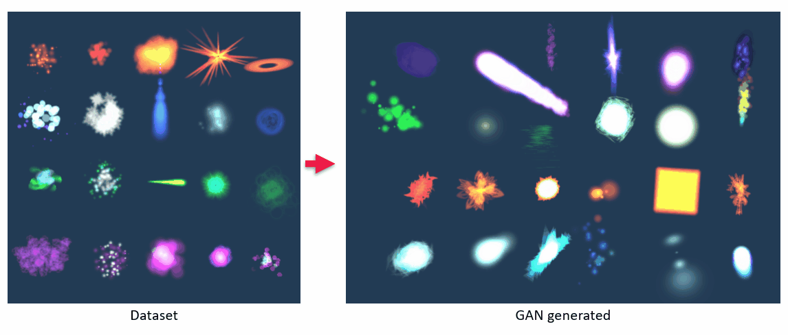
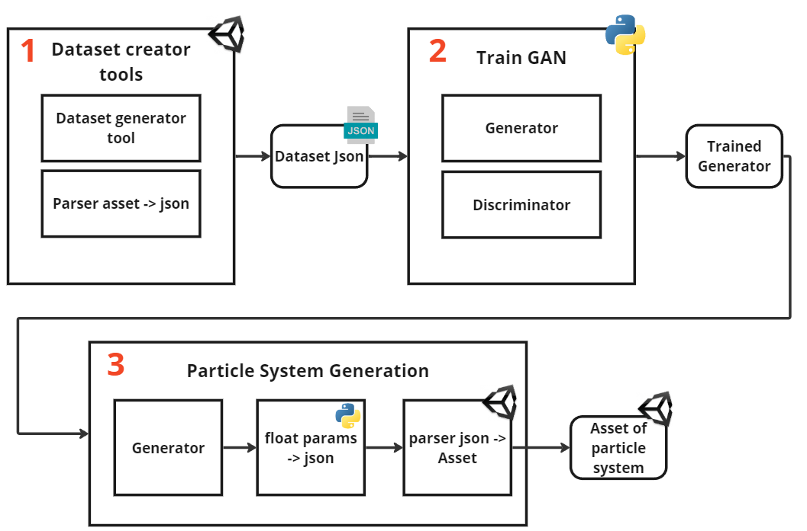
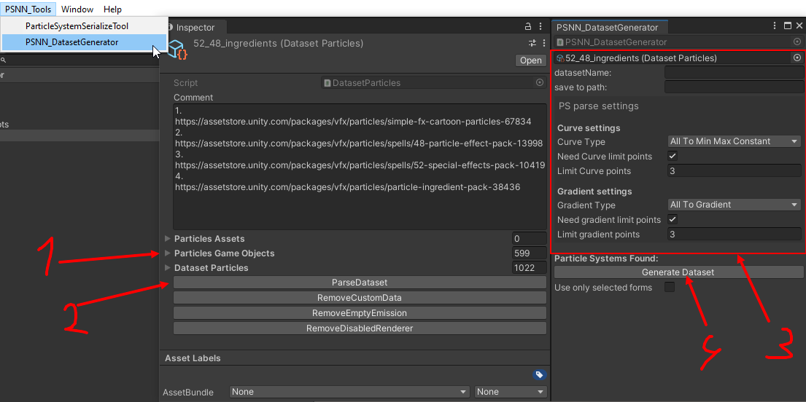
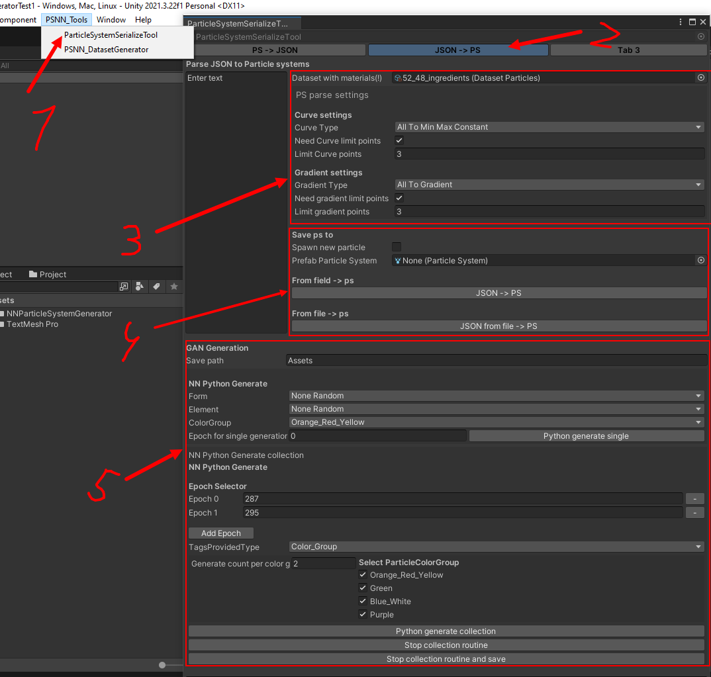
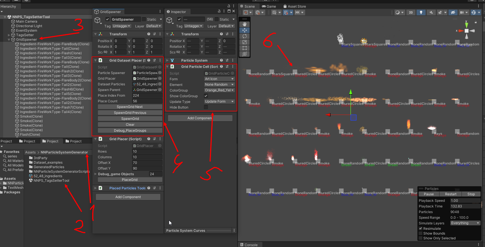
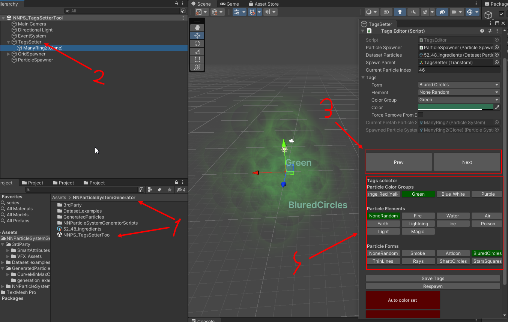

## Introduction

This project establishes an approach to integrating machine learning into the VFX creation pipeline.
It uses a GAN (Generative Adversarial Network) to generate Particle System assets for Unity.


_Figure 1: Example of GAN generated particle systems assets_
### Paper
You can read more about the scientific work in this [paper](readme_files/Manatov_GANParticlesGenerator_paper.pdf).
## Contents
1. [Introduction](#introduction)
   - [Paper](#paper)
   - [Approach](#approach)
2. [Install](#install)
   - [Setup Unity Project](#setup-unity-project)
   - [Setup Python Neural Network Project](#setup-python-neural-network-project)
3. [Usage Guide](#usage-guide)
   - [Dataset creator tool](#dataset-creator-tool)
   - [Train GAN](#train-gan)
   - [Generate particle systems](#generate-particle-systems)
   - [Tags editors](#tags-editors)
      - [Grid tag Editor](#grid-tag-editor)
      - [Individual tag Editor](#individual-tag-editor)


### Approach

1. **Dataset creator** Creating a Dataset from Specified VFX Assets in Unity: 
   - A custom tool in Unity is used to create and tag particle systems, generating a dataset.
   - Each dataset entry comprises a list of particle system parameters and tags in JSON format.
   - Non-numerical parameters, such as materials, are enumerated and used from the specified dataset during generation.

2. **Training GAN**: 
   - The dataset created in Unity is used to train a GAN in Python.
   - The generator outputs numerical parameters of the particle system, which are then parsed back into JSON.

3. **Generating Particle Systems in Unity**: 
   - A tool in Unity calls the Python generator, fills out the JSON, and parses it back into a particle system asset.


_Figure 2: Workflow of the project showing the process from dataset creation to particle system generation using GAN._

## Install
I used:
- [Unity](https://unity.com/)  2021.3.22
- Python [PyTorch](https://pytorch.org/) "torch==2.0.1+cu118" for my NVIDIA GeForce GTX 1660 Ti.

### Setup Unity Project

1. Clone this repository to your local machine:

    ```bash
    git clone <repository-url>
    ```

2. Open [Unity Hub](https://unity.com/unity-hub) and click on the "Add" button.

3. Navigate to the directory where you cloned the repository and select the Unity project folder (`NN_ParticlesGenerator`).

4. Once the project is added to Unity Hub, click on it to open the project.

5. Unity might need to resolve dependencies and compile scripts. Allow Unity to complete this process.

6. You're now ready to work with the Unity project.

### Setup Python Neural Network Project

1. Navigate to the Python neural network project folder [NN_Particles_Generator_Python](NN_Particles_Generator_Python).
2. Install the required Python packages [requirements.txt](NN_Particles_Generator_Python/requirements.txt)

    ```bash
    pip install -r requirements.txt
    ```


## Usage guide
### Dataset creator tool
To create dataset you need to create DatasetParticles ScriptableObject. This object will be used in dataset creation and generation.
- (1) Add assets to fields.
- (2) Button ParseDataset will extract all atomic particle system from selected assets. Also, there is buttons to clean up some dirty assets.
- Before generating dataset json you may need to edit tags for each particle. Tools for tag editing described here [Tags editors](#Tags-editors)
- (3) In PSNN_Tool tab open DatasetGenerator tool and fill fields with settings of dataset
- (4) Button GenerateDataset will parse all systems to one json file.

_Figure 3: Dataset creator tool interface

### Train GAN
1. **Configuration Settings:**
   - Edit the following settings in [Config.py](NN_Particles_Generator_Python/NN_Scripts/Config.py):
     - `DATASET_FILE`: Specify the dataset file path.
     - `SAVE_PATH_OBJECT`: Set the path where the neural network model will be saved.
   - Edit [GANStructure.py](NN_Particles_Generator_Python/NN_Scripts/GANStructure.py) and [GANLearning.py](NN_Particles_Generator_Python/NN_Scripts/GANLearning.py) to set your variation of hyperparameters and dataset settings
2. **Start training:**
   - Run [GANLearning.py](NN_Particles_Generator_Python/NN_Scripts/GANLearning.py) to initiate the learning process.

3. **Generating Particle Simulations:**
   - Execute [GenerateFromFile.py](NN_Particles_Generator_Python/NN_Scripts/GenerateFromFile.py) to generate particle simulations.
   - The results of the generations will be stored in [output.json](NN_Particles_Generator_Python/NN_Scripts/output.json).
   - Or use my Unity Generation Tool 


### Generate particle systems
To Generate assets you can use ParticleSystemSerializeTool. There is JSON -> PS Tab
where you can find tools to convert generated jsons to assets and use auto GAN Generation tool
tha automatically calls python [GenerateFromFile.py](NN_Particles_Generator_Python/NN_Scripts/GenerateFromFile.py) and can generate collections of assets.
- (1) Open tool
- (2) Tab to generate
- (3) Parse settings of generated particles
- (4) Tool to parse entered json if you want to use json manually
- (5) GAN Generation block - fill needed settings to generate assets. There you can generate single asset or select epoches of generation and needed tags and count of particles


_Figure 4: Generation tool interface


### Tags editors
To generate particle system by tag we need to set up tags at dataset. There are 2 tool to do this.
#### Grid tag Editor
- (1)(2) Open special scene [NNPS_TagsSetterTool.unity](Assets/NNParticleSystemGenerator/NNPS_TagsSetterTool.unity) in Unity for editing tags
- (3) Right click on GridSpawner Object and open "properties" window
- (4) In opened GridSpawner interface you can spawn bunch particle systems in scene
- (5) Automatically spawned particles will be selected and in inspector you can choose settings how you want to edit tags
- (6) Clicking on white square button will edit the corresponding entry in the dataset

_Figure 5: Grid tag Editor tool interface

#### Individual tag Editor
- (1) Open special scene [NNPS_TagsSetterTool.unity](Assets/NNParticleSystemGenerator/NNPS_TagsSetterTool.unity) in Unity for editing tags
- (2) Right click on TagsSetter Object and open "properties" window
- (3) Click on next\prev buttons spawn particle in scene
- (4) Selecting tags will automatically edit the corresponding entry in the dataset

_Figure 6: Individual tag Editor tool interface
